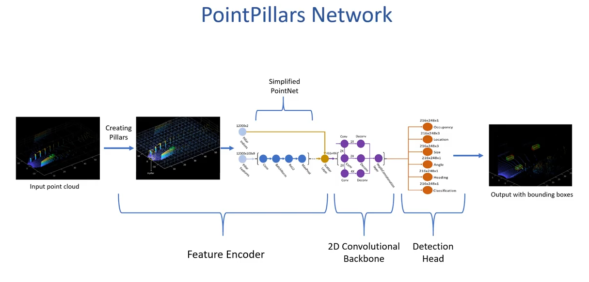
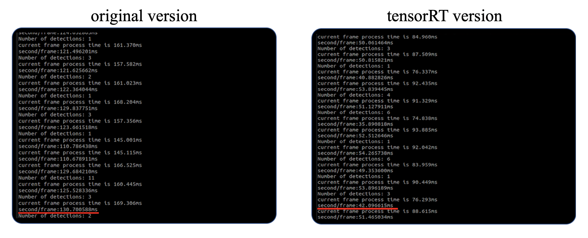
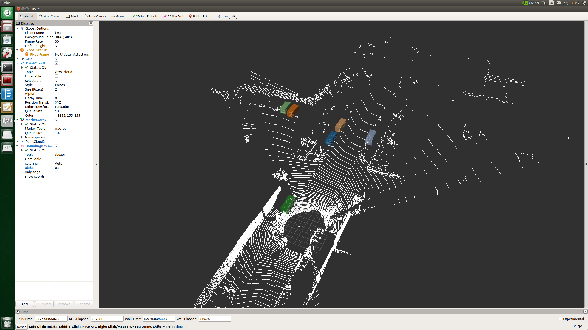

# PointPillars (train with CUDA and inference with TensorRT)

A rewrite verson of Lidar detection deeplearning framework ([PointPillars](https://github.com/traveller59/second.pytorch)) for autonomous-driving (pc or vehicle computer) applications.

### [This repo is not maintained， and the overall redundancy is not suitable for deployment on the vehicle].

# What's this Repository

you can use it repository to achieve `fast Lidar detection` in your autoware device. (only test in Nvidia Xavier: each frame process less than `50 ms`!)

## what's PointPillars


[Pointpillars](https://github.com/traveller59/second.pytorch) demonstrates how to reproduce the results from
[_PointPillars: Fast Encoders for Object Detection from Point Clouds_](https://arxiv.org/abs/1812.05784) (to be published at CVPR 2019) on the
[KITTI dataset](http://www.cvlibs.net/datasets/kitti/) by making the minimum required changes from the preexisting
open source codebase [SECOND](https://github.com/traveller59/second.pytorch). 

This is not an official nuTonomy codebase, but it can be used to match the published PointPillars results.

**WARNING: This code is not being actively maintained. This code can be used to reproduce the results in the first version of the paper, https://arxiv.org/abs/1812.05784v1. For an actively maintained repository that can also reproduce PointPillars results on nuScenes, we recommend using [SECOND](https://github.com/traveller59/second.pytorch). We are not the owners of the repository, but we have worked with the author and endorse his code.**


## Deep Learning Implementation for Getting Bounding Boxes from Lidar Point Clouds 


## The overall workflow is as follow:
```
1:  Training and evaluating on your GPU device with Pytorch to get the suitable weights
                                    ||
                                    ||
                                    \/
2:  Transfer the original submodels (with weights)to tensorrt version(pfn.trt and bankbone.trt).
                                    ||
                                    ||
                                    \/
3:  Detecting objects of original pointcloud (x,y,z,intensity) on vehicle device.
```

## A general workflow for any TensorRT Conversion :
```
1:  Training and evaluating on your GPU device with Pytorch to get the suitable weights
                                    ||
                                    \/
2:  Conversion of Weights to a model checkpoint { pfn.trt and bankbone.trt }
                                    ||
                                    \/
3:  Create TensorRT Network 
                                    ||
                                    \/
4:  Create (optional: additional) layers for analysis
                                    ||
                                    \/
5:  Build the tensorRT Inference Engine (Quantization, Decoding, AMT-FP16 conversion etc), 
```
 
```
                                    ||
                                    \/
6:  Retrieving the engine from inference Engine 
                                    ||
                                    \/
7:  Deploy Model 
```

## The Repository Overview 
```
├── core
├── data
├── docs
├── libs
│   ├── ops
│   │   ├── cc
│   │   │   └── nms
│   │   ├── non_max_suppression
│   │   └── point_cloud
│   └── tools
│       └── buildtools
├── logs
├── models
│   ├── bones                        <------ The sub-modules list here
│   └── detectors                    <------ The Main network lies here
└── params
    ├── configs
    ├── {./Path/to/your TensorRT files(.trt)}
    └── {./Path/to/your weights files(.ckpt)}
```
# Requirements

## Hardware (used two different GPUs device)
```
Device 1: NVIDIA GeForce 2070Ti：
            ├── SM-75                       
            └── 4GB or more of memory
```
```
Device 2: NVIDIA Jstson AGX xavier:        
            └── SM-72
```

## Software
 - ONLY supports python 3.6+, pytorch 1.1+, Ubuntu 18.04.
 - CUDA 9.0+
 - CuDNN 7+
 - TensorRT 6.0 (only need for xavier)
 
# Install
1.Refer to [TRAIN.md](docs/TRAIN.md) for the installation of the training stage of `PointPillars` on 2070Ti.

2.Refer to [INFERENCE.md](docs/INFERENCE.md) for the installation of the inference stage of `PointPillars` on xavier.

#Performance

## Faster runtime!
This is mainly due to TensorRT, which makes the network runs `four times` faster than the original version.(test on Nvidia Xavier)


## Accuracy
Emmmm.....It seem doesn't look bad either..lmao. 


# References
- [nutonomy/second.pytorch](https://github.com/nutonomy/second.pytorch)
- [wangguojun2018/PointPillars_Tensorrt](https://github.com/wangguojun2018/PointPillars_Tensorrt)
- [open-mmlab/OpenPCDet](https://github.com/open-mmlab/OpenPCDet)
